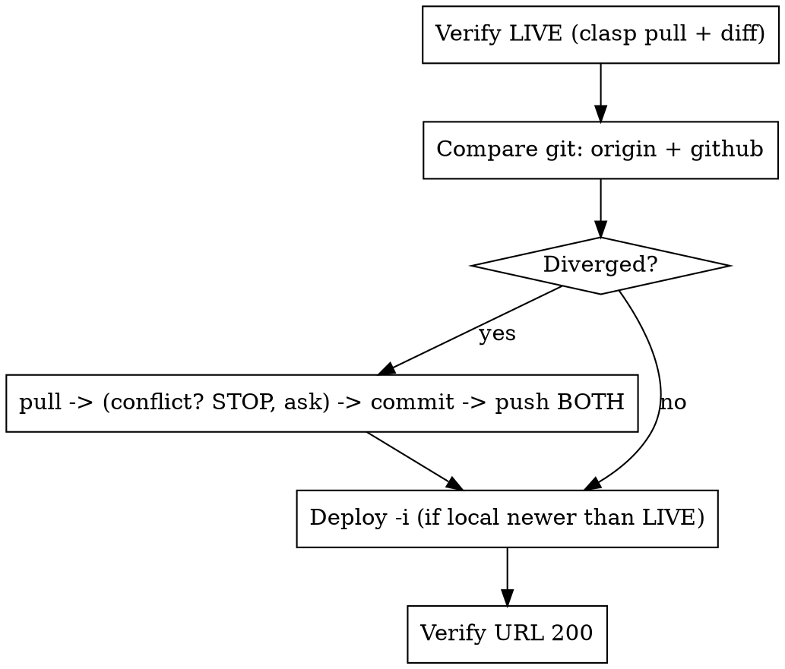

# Sync · Verify · Deploy (PEA GAS monorepo)

Full runbook to answer "is local == GitHub == Apps Script?" for **certain**, fix any drift, and deploy without breaking URLs. Complements `sync-status` (git/clasp-status overview) and `deploy-pipeline` (deploy mechanics) — this skill adds the **byte-diff proof of what is LIVE** and **dual-remote** handling.

## Critical environment facts (get these wrong = wrong answer)

- **Two git remotes**: `origin` = GitLab, `github` = GitHub. Must fetch/compare/push **both**.
- **clasp 3.x**: `push` needs `--force`; `whoami` was removed (verify auth via a successful `clasp pull` instead).
- **Thai folder names** (`เบิกของ`, `Teco_WBS` is ASCII but most are Thai): bash `cd` breaks. Use Python `subprocess` with `cwd=` + `clasp.cmd`, stdout reconfigured to UTF-8.
- **Stable URL**: deploy ONLY with `clasp deploy -i <deploymentId>` (id from `deploy-config.json`, the single source of truth). Bare `clasp deploy` mints a new URL and 404s every user.
- **CRLF vs LF**: `clasp pull` returns LF; local may be CRLF. Same byte size + "DIFF" usually = line-endings only — judge by the file whose **size** differs.

## Workflow



### 1. Verify LIVE Apps Script (the part `clasp status` CANNOT do)
`clasp status` only lists files that *would* push — it does NOT compare to the deployed script. To prove local == live, pull the live source into a temp dir and byte-diff. Use the helper:

```bash
python .claude/skills/sync-verify-deploy/verify_live.py RPA_B2_TO_C1 เบิกของ Teco_WBS
```

Output per file: `SAME` / `DIFF` with sizes. **local size > LIVE size** ⇒ local newer, not deployed. **LIVE size > local** ⇒ local stale, pull first.

### 2. Compare git across BOTH remotes
```bash
git fetch origin && git fetch github
git rev-list --left-right --count origin/main...HEAD   # left=remote-only(behind) right=local-only(ahead)
git rev-list --left-right --count github/main...HEAD
git status --short
```

### 3. Sync (order matters on a diverged branch)
1. `git pull origin main` — **if merge conflict: STOP and ask the user** which side to keep; never auto-resolve. Watch `deploy-config.json` especially.
2. `git add <specific files>` (never `-A`; skip `.claude/settings.local.json`), commit with trailing `Co-Authored-By: Claude Opus 4.8 (1M context) <noreply@anthropic.com>`.
3. Push **both**: `git push origin main` then `git push github main`. Confirm each shows `0  0`.

### 4. Deploy (only projects where local is newer than LIVE)
```bash
# via Python cwd= for Thai folders; clasp 3.x:
clasp push --force
clasp deploy -i <deploymentId-from-deploy-config.json>
```
Pre-flight first: confirm new innerHTML/badges go through `escapeHtml()` (XSS), deploymentId is real. Then verify: `curl -s -o /dev/null -w "%{http_code}" "<exec-url>"` → expect `200`.

## Common Mistakes
| Mistake | Consequence | Fix |
|---|---|---|
| Trusting `clasp status` as a remote diff | False "synced" | clasp pull + byte-diff (step 1) |
| bash `cd "เบิกของ"` | Path/encoding failure | Python `cwd=` + `clasp.cmd` |
| Pushing only `origin` | GitHub silently stale | push origin AND github |
| Bare `clasp deploy` | URL changes, users 404 | always `-i <deploymentId>` |
| Auto-resolving a merge conflict | Lost doc/config edits | STOP, ask the user |
| `git add -A` | Commits private `settings.local.json` | add only intended files |
