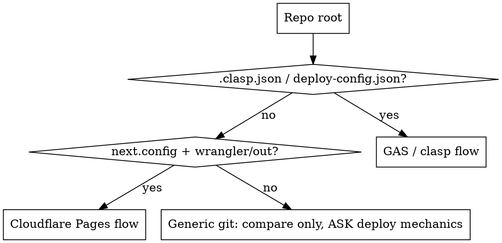

# Sync · Verify · Deploy (auto-detecting)

Full runbook to answer "is local == git == LIVE?" for **certain**, fix any drift, and deploy
without breaking the URL — **in whatever project you're standing in**. The *spirit* is constant:
byte-level (or version-level) proof of what is LIVE, dual/multi-remote git handling, stable-URL
deploys, post-deploy verification. Only the *mechanics* branch by project type, which you
**detect yourself** (Step 0). Do NOT assume the GAS monorepo — detect first.

## Step 0 — Detect the project type FIRST (do not skip)

Check the repo root (and look one level down for nested clasp projects). **First match wins:**

| Signal in repo | Type | Verify-LIVE method | Deploy method |
|---|---|---|---|
| `.clasp.json` (incl. nested) **or** `deploy-config.json` | **GAS / clasp** | `verify_live.py` (clasp pull + byte-diff) | `clasp deploy -i <id>` |
| `next.config.*` with `output:"export"` (or an `out/` build dir) **and** `wrangler` referenced in CLAUDE.md / `package.json` / a `wrangler.toml` | **Static → Cloudflare Pages** | `wrangler pages deployment list` + version-meta + Access-lock curl | `npm run build` → `wrangler pages deploy <out> --project-name <n> --branch <b>` |
| a git repo, host not recognized | **Generic git** | git compare only | **ASK the user** the deploy mechanics; never guess |



**Git remotes are also detected, not assumed.** Run `git remote` and compare/push against
**every** configured remote; detect the deploy branch (`master` vs `main`) — don't hard-code `main`.

---

## Type: GAS / clasp (the PEA monorepo)

### Critical environment facts (get these wrong = wrong answer)

- **Two git remotes**: `origin` = GitLab, `github` = GitHub. Must fetch/compare/push **both**.
- **clasp 3.x**: `push` needs `--force`; `whoami` was removed (verify auth via a successful `clasp pull` instead).
- **Thai folder names** (`เบิกของ`, `Teco_WBS` is ASCII but most are Thai): bash `cd` breaks. Use Python `subprocess` with `cwd=` + `clasp.cmd`, stdout reconfigured to UTF-8.
- **Stable URL**: deploy ONLY with `clasp deploy -i <deploymentId>` (id from `deploy-config.json`, the single source of truth). Bare `clasp deploy` mints a new URL and 404s every user.
- **CRLF vs LF**: `clasp pull` returns LF; local may be CRLF. Same byte size + "DIFF" usually = line-endings only — judge by the file whose **size** differs.

### 1. Verify LIVE Apps Script (the part `clasp status` CANNOT do)
`clasp status` only lists files that *would* push — it does NOT compare to the deployed script. To prove local == live, pull the live source into a temp dir and byte-diff. Use the helper:

```bash
python C:/Users/510273/.claude/skills/sync-verify-deploy/verify_live.py RPA_B2_TO_C1 เบิกของ Teco_WBS
```

Output per file: `SAME` / `DIFF` with sizes. **local size > LIVE size** ⇒ local newer, not deployed. **LIVE size > local** ⇒ local stale, pull first.

### 2. Compare git across BOTH remotes
```bash
git fetch origin && git fetch github
git rev-list --left-right --count origin/main...HEAD   # left=remote-only(behind) right=local-only(ahead)
git rev-list --left-right --count github/main...HEAD
git status --short
```

### 3. Sync (order matters on a diverged branch)
1. `git pull origin main` — **if merge conflict: STOP and ask the user** which side to keep; never auto-resolve. Watch `deploy-config.json` especially.
2. `git add <specific files>` (never `-A`; skip `.claude/settings.local.json`), commit with trailing `Co-Authored-By: Claude Opus 4.8 (1M context) <noreply@anthropic.com>`.
3. Push **both**: `git push origin main` then `git push github main`. Confirm each shows `0  0`.

### 4. Deploy (only projects where local is newer than LIVE)
```bash
# via Python cwd= for Thai folders; clasp 3.x:
clasp push --force
clasp deploy -i <deploymentId-from-deploy-config.json>
```
Pre-flight first: confirm new innerHTML/badges go through `escapeHtml()` (XSS), deploymentId is real. Then verify: `curl -s -o /dev/null -w "%{http_code}" "<exec-url>"` → expect `200`.

---

## Type: Static site → Cloudflare Pages (e.g. wordhtml)

A prebuilt static export uploaded to Cloudflare Pages by direct upload. No clasp, usually a
**single** git remote, and the site may be behind **Cloudflare Access**.

### 1. Verify LIVE
- **Deployment list** (needs `CLOUDFLARE_API_TOKEN` **or** `wrangler login` — gate first):
  ```bash
  npx wrangler pages deployment list --project-name <name>
  ```
  Gives the latest deployment's id / timestamp / branch.
- **You usually CANNOT byte-diff the live HTML** — an Access-locked site returns the login page,
  not your app. Prove freshness instead by comparing the **version baked into the build** vs the
  git HEAD you intend to ship: read `app-version` meta in `out/index.html` (or `package.json`
  `version`) and compare to the commit/version that is canonical on the deploy branch.
- **Unauthenticated health check (inverts the GAS "expect 200" rule):**
  ```bash
  curl -sI https://<host> | head -1
  ```
  On an Access-locked site, **HTTP 302 → `…cloudflareaccess.com` = lock intact / healthy** (NOT a
  failure). A 200 from an unauthenticated request would mean the lock is OFF.

### 2. Compare git across ALL remotes (discovered, not assumed)
```bash
for r in $(git remote); do git fetch -q "$r"; done
git remote                                   # often just 'origin' here
# pick the deploy branch (master|main) from the repo / CLAUDE.md
git rev-list --left-right --count origin/master...HEAD   # left=behind right=ahead
git rev-list --left-right --count master...origin/master # local deploy branch vs remote
git status --short
```
The **canonical deploy source is the deploy branch on the remote** (e.g. `origin/master`), even if
your working branch is something else. Deploy from there, not from a stale checkout.

### 3. Sync
Same discipline as GAS: `git pull` → **conflict? STOP and ask**; `git add <specific files>` (never
`-A`, skip `.claude/settings.local.json`); commit trailer
`Co-Authored-By: Claude Opus 4.8 <noreply@anthropic.com>`; push **every** remote and confirm `0 0`.

### 4. Deploy
Pre-flight:
- `.env.local` present if the build bakes secrets (e.g. `NEXT_PUBLIC_FIREBASE_*`) — otherwise the
  static bundle ships with those features disabled.
- You are on the **canonical deploy branch** (e.g. fast-forward local `master` → `origin/master`).
- **Auth gate:** if no `CLOUDFLARE_API_TOKEN` and not logged in → **STOP and ask the user to run
  `! npx wrangler login`** (interactive — you cannot do it inside a tool).

```bash
npm run build       # produces ./out (Next.js export + any SW step)
npx wrangler pages deploy out --project-name <name> --branch <deploy-branch>
```

**Stable-URL rule (CF analogue of `clasp deploy -i`):** always deploy to the **same
`--project-name` and production branch**. Never create a new Pages project — the production domain,
Firebase authorized-domain entry, and the Cloudflare Access lock are all bound to that hostname and
survive redeploys. Each deploy still mints a per-deploy `<hash>.<project>.pages.dev` preview alias;
that's expected (a `*.<project>.pages.dev` Access rule keeps previews locked too).

### 5. Verify after deploy
- wrangler prints the deployment URL; the new deployment appears in `wrangler pages deployment list`.
- `curl -sI https://<host> | head -1` → **302 to cloudflareaccess.com** (Access still locked).
- Optionally confirm the shipped version by reading `app-version` from the freshly built
  `out/index.html` you just uploaded.

---

## Type: Generic git (host not recognized)

Do the git compare (Section "Compare git across ALL remotes" above) and report drift. For the
**deploy step, STOP and ask the user** how this project ships (host, command, stable-URL concern) —
never guess a deploy mechanism.

---

## Common Mistakes
| Mistake | Consequence | Fix |
|---|---|---|
| Skipping Step 0 / assuming GAS | Wrong tooling in a non-clasp repo | Detect type first (`.clasp.json` vs `next.config`+`out/`) |
| Trusting `clasp status` as a remote diff | False "synced" | clasp pull + byte-diff (GAS §1) |
| bash `cd "เบิกของ"` | Path/encoding failure | Python `cwd=` + `clasp.cmd` |
| Assuming remotes are origin=GitLab/github=GitHub | Wrong / missed remote | Discover via `git remote`; push every one |
| Bare `clasp deploy` | URL changes, users 404 | always `-i <deploymentId>` |
| Expecting HTTP 200 on an Access-locked site | False "site down" alarm | **302 → cloudflareaccess.com = healthy** |
| Running `wrangler pages …` with no auth | Command fails / hangs | set `CLOUDFLARE_API_TOKEN` or `wrangler login` first |
| Deploying from a stale branch | Ships an old version | build+deploy the canonical deploy branch (e.g. `origin/master`) |
| Creating a new Pages project / new clasp deployment | URL changes, breaks lock | reuse same `--project-name` / `-i <id>` |
| Auto-resolving a merge conflict | Lost doc/config edits | STOP, ask the user |
| `git add -A` | Commits private `settings.local.json` | add only intended files |
